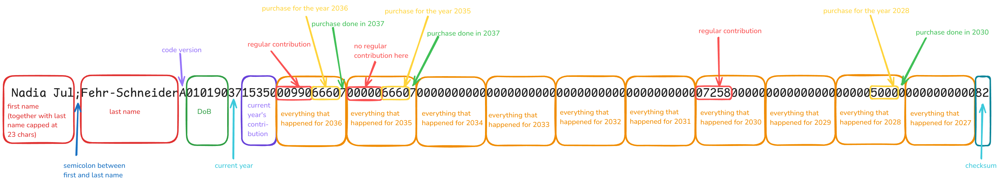

# DRAFT: 3a Contribution Transfer Reference

*Important note: This specification is still at the draft stage and is subject to change. Feedback on [GitHub](https://github.com/true-wealth/3a-transfer-reference) as a [pull request](https://github.com/true-wealth/3a-transfer-reference/pulls) or [issue](https://github.com/true-wealth/3a-transfer-reference/issues) is welcome.*

## Intro

The amendment to the ordinance stipulates that in the event of a transfer of pension capital pursuant to Article 3a paragraph 1 letter b, the transferring institution must provide the new institution with the following information:

*   The contributions made in the previous ten years in accordance with Article 7 paragraph 1.
*   The contributions made as a purchase in the previous ten years, including an indication of which contribution gaps have been offset as a result.

In order to implement these requirements efficiently and in compliance with the law, we have developed a new process in which all relevant data is transmitted directly in the remittance information which can contain up to 140 characters (according to SIX Swiss Payment Standards). This process makes it possible to transfer the information completely and unambiguously between the foundations without the need for additional communication channels such as letters or emails. The chosen format is designed to summarize all relevant data in a compact structure of no more than 140 characters. It contains the first and last name, version, date of birth, regular contributions, purchases and the purchase year, supplemented by a checksum to ensure that the data has been transferred correctly. This document explains the implementation of the compact and secure digital transmission of contribution and purchase data with a checksum.

Advantage of this solution:

*   All required information is included directly in payment
*   Every case can be digitally transferred, also self employed
*   The customer does not have to wait until he can make purchases or withdrawals at the new 3a foundation, as if the transfer of the information is made by post or mail which takes a few days
*   Full automation of processes with IT tools is possible

Points considered:

*   No specific date, just year
    *   This is not an issue since only the year is relevant for tax purposes.
*   Rounding to 1 Swiss franc
    *   This is not an issue since values used for tax reporting are rounded the same way (for example in Form.21EDP dfi/A4).
*   Year in date of birth is only 2 digits
    *   Since 3a is relevant until retirement age, there should be no cases of clients older than 100 years.
*   Hard to read without a helper software
    *   An online tool (client only, no data transmission) for encoding and decoding the transfer reference is provided free of charge (see below).
    *   Full specification is available for everybody interested.
*   Information security
    *   It is a common practice already nowadays that client name, date of birth and in some cases even AHV-Number is included in the payment purpose. Data is only visible to those having access to payment information anyway. No additional communication channel needed.
*   Purchase amount
    *   Self-employed persons and employees can make a purchase into pillar 3a up to the maximum amount of a small contribution (7258.- in 2025). If the maximum AHV pension is so high in the future that the small contribution exceeds 9999.- the 4 places will no longer be sufficient. However, the contribution in 2005 was 6192. Accordingly, it is estimated that it will take another 40 years before the limit of 9999.- is exceeded and the four digit number considered in the code is no longer sufficient.    

## Example

Information we will transfer in transfer Credit Transfer Transaction Information cell as one single line:

`first name;last nameA1009972715350320356660700000000000000000000000000000000000000000000000000000000000000000000000000000000000000000061`

| **Value**  | **Explanation**                                                                                                                                    |
|------------|----------------------------------------------------------------------------------------------------------------------------------------------------|
| first name | if client has more than one first name, they are separated by a space                                                                              |
| last name  | if client has more than one last name, they are separated by a space                                                                               |
| A          | version used for encoding the transfer reference (currently only version A is available)                                                           |
| 100997     | client date of birth (ddmmyy)                                                                                                                      |
| 27         | reference year - indicates current year when the transfer has been initiated                                                                       |
| 15350      | total contributions in CHF of the current year (2027 in this example)                                                                              |
| 32035      | regular contribution in CHF in the previous year (2026 in this example)                                                                            |
| 6660       | purchase amount in CHF in the previous year (2026 in this example)                                                                                 |
| 7          | represents year 2027 - is the year in which the purchase was made for 2026                                                                         |
| 61         | checksum                                                                                                                                           |
| 0000…00    | placeholders for all other years, as long as the account exists less than 10 years or the year at the time of the era release is smaller than 2035 |

Code would look like this in 2027:

`Mike Mi;Mustermann MiA0101902715350320356660732035666060000000000000000000000000000000000000000000000000000000000000000000000000000000000098`

27 - current year; contributions 2027; contributions 2026; purchase 2026; purchase year; contributions 2025; purchase 2025; purchase year; placeholders; checksum

Code without name (starting with date of birth) can look like this in 2037 reach back to 2026 (116 characters):

`A0101013715350320356660732035666063203566605320356660432035666033203566602320356660132035666003203566609320356660879`

## Checksum

In order to ensure that the data has been transferred correctly, a checksum is included to the code. ‘Mode97’ algorithm is used. Mod97 checksums are also used to check IBANs and offers a high level of security against input errors such as transposed numbers and transposed letters. It takes letters into account by converting them into numbers, is standardised and two digits long. A detailed explanation of the checksum can be found here: [https://en.wikipedia.org/wiki/International_Bank_Account_Number#Modulo_operation_on_IBAN](https://en.wikipedia.org/wiki/International_Bank_Account_Number#Modulo_operation_on_IBAN)

The name part is not included in the checksum, checksum starts with version code.

the following components are included in the checksum:

*   version
*   date of birth
*   reference year
*   all regular contributions
*   all purchases
*   all year numbers
*   checksum

## Structure

The code does not contain any semi-colons or other separators. The number of characters for a year or a contribution amount is always fixed with 0 padding on left side (see example below ‘Example same number of characters in code’), the code always has the same length, namely exactly 116 characters.

This means that up to 24 characters are available for the name area. One character must be subtracted for a semi-colon that is used to separate the first and last name.

This means that up to 23 characters are available for the first and last name in total. The name part does not need to be padded, it can also be less than 23 characters.

Only first and last name may contain spaces. Any other spaces / newlines added for / in transmission must be stripped before parsing.

### Length of client name

Up to 23 characters are available for the first and last name. If the combination of first and last name is shorter than 23 characters, no placeholders should be added. If the combination of first and last name is longer than 23 characters, then the first name is truncated to 9 characters. The last name is truncated to 14 characters.

For example, if a customers first name is “Mike” and the last name is “Mills” the code will look like this: `Mike;MillsA0101902715350320356660732035666060000000000000000000000000000000000000000000000000000000000000000000000000000000000098`

### Summary

| **Number of characters**                              | **Value**                                                  |
|-------------------------------------------------------|------------------------------------------------------------|
| 1                                                     | Version (currently only version A is available)            |
| 107                                                   | Contributions / purchase history                           |
| 6                                                     | Date of birth                                              |
| 2                                                     | Checksum                                                   |
| min. 14 if available, dynamic, first + last = max. 23 | Last name                                                  |
| 1                                                     | Separate last - and first name with `;`                    |
| min. 9 if available, dynamic, first + last = max. 23  | First Name                                                 |
| max. 140                                              | Total (if names are shorter, it can also be less than 140) |

## Edge-cases

### What if a client has no contribution or purchase made in a year?

*   Each number always contains exactly the same number of digits. If, for example, no purchase is made in a year, this is entered as `0000`. This ensures that the code always has the same length and can be read by the system.
*   Example: Mike Mustermann made no purchases for 2026 and paid no regular contributions in 2027. The code then looks like this: `Mike Mint;Mustermann MiA2700120320350000000...0098`
    *   `Mike Mint;Mustermann Mi` → Name
    *   `A` → version
    *   `27` → reference year
    *   `00120` → CHF 120 regular contributions in 2027
    *   `32035` → regular contributions in 2026
    *   `0000` → no purchase into year 2026
    *   `0`→ no year in which a purchase was made into the year 2026 (see explanation below)
    *   `00...00` → placeholders for years not in use
    *   `98` → checksum

### What if a customer has made no purchase in a given year?

*   A `0` as a year (the number that indicates the year in which a purchase was made) is interpreted in two different ways.
*   Variant 1: A purchase was made into 2029. Then the 0 stands for the year 2030.
    *   Example: `...30350003203555100...` here the last `0` stands for the year 2030    
*   Variant 2: No purchase was made in 2029. In this case, the `0` is considered a place holder, as no purchase was made in this year, the 0 cannot stand for a year in which the purchase was made.
    *   Example: `...30350003203555100...` here the last `0` is a place holder    *   Example if a customer made no contributions for a certain period: `Mike;MillsA010190371535032035666073203566606000000000000000000000000000000135053540500000000000000000000000000000000000000000000000000098`

### What does the code look like until 2035?

As gaps in the 3a can only occur from 2025, placeholders for the years before 2025 are used until 2035. These placeholders are filled with ‘0’. The number of “0” depends on the number to be replaced.

*   Regular contribution → replaced by “00000”
*   Purchase → replaced by “0000”
*   Year number → replaced by “0”

Example how the code in 2027 will look like:

`Mike Mi;Mustermann MiA0101902715350320356660732035666060000000000000000000000000000000000000000000000000000000000000000000000000000000000098`

### What if a customer's first name and last name are longer than they should be?

*   Example:*   a clients first name is “Mike Robertson Mint Rickson” → 27 characters    *   a clients last name is “Miller Mustermann Zimmermann” → 28 characters
*   In this case, both names are shortened to the following:*   first name “Mike Robe” → 9 characters    *   last name “Miller Musterm” → 14 characters

### What if a customers first or last name is shorter than the possible characters?

*   Example:
    *   a clients first name is “Mike” → 4 characters
    *   a clients last name is “Miller Mustermann Zimmermann” → 28 characters
*   in this case, the leftover character created by the short first name ‘mike’ can be used by the last name
*   the total characters for first and last name is more than 23 so the last name will be shortened*   The code will look like: `Mike;Miller Mustermann ZA010199....`
    *   Mike → total name is displayed
    *   Miller Mustermann Zimmermann → is shortened to “Miller Mustermann Z”
*   the same rule applies, if the last name is shorter than 14 characters, the leftover characters can be use for the first name

### The E-Banking enforces a split the 140 characters into 4 lines with 35 characters each.

*   Lines can be split with newline (return / enter). The lines ending with a newline may only contain 34 characters instead (return is also counted as one character).
*   In this case, the first and last name must be reduced by 3 characters in order to not overflow.
*   If the first name or surname does not reach the maximum number of characters, the remaining characters are used to fill the gap until the maximum length of the first name and surname is reached. If this is not enough, the first name is shortened.

## Acceptance check of this specification

In this section we prove that all necessary information as mentioned in article 3a paragraph 1 letter b is reflected in our code.

Code example transmitted in 2027: `...27153503203566607220351560600...0000`

Code separated by semi-colon for better readability: …27;15350;32035;6660;722035;1560;6;00…00;00

*   Regular contribution payments made to the previous foundation in the past 10 years.
    *   `15350` → regular contributions current year (2027)
    *   `32035` → regular contributions year 2026
    *   `22035` → regular contributions year 2025    
*   All purchases the person made in the past 10 years.
    *   `6660`→ purchases into year 2026 (current year)
    *   `7` → year (2027) purchase was made into 2026
    *   `1560`→ purchases into year 2025
    *   `6` → year (2025) purchase was made into 2026    
*   Which annual contribution gaps have been closed
    *   `6660`, `7` → purchase of 6660 in 2027 closed contribution gap in 2026
    *   `1560`, `6` → purchase of 1560 in 2026 closed contribution gap in 2025    
*   The use of no decimal places
    *   As is usual for taxable values and income in the tax return, amounts are rounded to whole francs in accordance with commercial practice.
    *   Decimal figures >=5 are rounded up
    *   Decimal figures <=4 are rounded down
    *   Example of a use case: Customer pays CHF 1150.55 into pillar 3a. This amount is shown in the code as 1151
    *   Applying this rule corresponds to the practice in the tax procedure. See [tax statement](https://www.estv.admin.ch/dam/estv/de/dokumente/dbst/formulare/dbst-form-2011-21edp-de.pdf.download.pdf/dbst-form-2011-21edp-de.pdf "https://www.estv.admin.ch/dam/estv/de/dokumente/dbst/formulare/dbst-form-2011-21edp-de.pdf.download.pdf/dbst-form-2011-21edp-de.pdf") or [ZH tax declaration](https://www.zh.ch/content/dam/zhweb/bilder-dokumente/themen/steuern-finanzen/steuern/natuerlichepersonen/2022/est-wegleitungen/305_wegleitung_zh_2022_ha_bf_def.pdf).    

## Reference implementation

A reference implementation is available: [https://true-wealth.github.io/3a-transfer-reference/assets/calculator.html](https://true-wealth.github.io/3a-transfer-reference/assets/calculator.html). This implementation is a simple web application that allows you to encode and decode the transfer reference. The implementation is open source and can be copied and used freely.

## External references

*   SIX Swiss Payment Standards: [https://www.six-group.com/dam/download/banking-services/standardization/sps/ig-credit-transfer-v2.0.2-de.pdf](https://www.six-group.com/dam/download/banking-services/standardization/sps/ig-credit-transfer-v2.0.2-de.pdf)
*   Form.21EDP dfi/A4: [https://www.estv.admin.ch/dam/estv/de/dokumente/dbst/formulare/dbst-form-2011-21edp-de.pdf.download.pdf/dbst-form-2011-21edp-de.pdf](https://www.estv.admin.ch/dam/estv/de/dokumente/dbst/formulare/dbst-form-2011-21edp-de.pdf.download.pdf/dbst-form-2011-21edp-de.pdf)
*   BFS Vor- und Nachnamen in der Schweiz: [https://www.bfs.admin.ch/bfs/de/home/statistiken/bevoelkerung/geburten-todesfaelle/namen-schweiz.html](https://www.bfs.admin.ch/bfs/de/home/statistiken/bevoelkerung/geburten-todesfaelle/namen-schweiz.html)
*   ZH Wegleitung zur Steuererklärung: [https://www.zh.ch/content/dam/zhweb/bilder-dokumente/themen/steuern-finanzen/steuern/natuerlichepersonen/2022/est-wegleitungen/305\_wegleitung\_zh\_2022\_ha\_bf\_def.pdf](https://www.zh.ch/content/dam/zhweb/bilder-dokumente/themen/steuern-finanzen/steuern/natuerlichepersonen/2022/est-wegleitungen/305_wegleitung_zh_2022_ha_bf_def.pdf)
*   Mod 97: [https://en.wikipedia.org/wiki/International_Bank_Account_Number#Modulo_operation_on_IBAN](https://en.wikipedia.org/wiki/International_Bank_Account_Number#Modulo_operation_on_IBAN)
